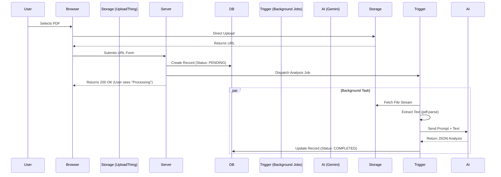

# 🚀 AI Resume Analyzer

> **Transform your resume with actionable, AI-driven intelligence.**

A modern, high-performance web application designed to help job seekers optimize their resumes for Applicant Tracking Systems (ATS) and human recruiters. Built with an event-driven architecture to handle heavy AI processing workloads without compromising user experience.

## 📸 A view of the app


---

## 🧠 Engineering & Architecture

We moved beyond the traditional "MVP" architecture to build a system that scales. Here is a deep dive into our technical decision-making process.

### 1. The Core Problem: Long-Running Processes

Analyzing a resume is computationally and temporally expensive:

1.  **Transport**: Uploading large PDFs to a server.
2.  **Processing**: Parsing binary PDF data into raw text.
3.  **Inference**: Sending massive context windows to an LLM (Gemini) and waiting for token generation.

**The Naive Approach (Synchronous):**
A standard Request/Response cycle would timeout. If the user uploads a file, and the server tries to do all 3 steps above in one go, the browser spinner would hang for 30-60 seconds. This kills UX and occupies a server thread, making the app vulnerable to DoS.

### 2. The Solution: Async, Event-Driven Architecture

We implemented a decoupled, non-blocking pipeline:

**Step A: Direct-to-Cloud Upload (Bypassing Server RAM)**
Instead of streaming the file `Browser -> Server RAM -> S3`, we used **UploadThing**.

- The client requests a "Presigned URL".
- The browser uploads the file **directly** to the storage bucket.
- **Benefit**: Our Node.js server never sees the file blob, saving massive bandwidth and RAM.

**Step B: The "Pointer" Hand-off**
Once the upload finishes, the client sends only the `fileUrl` (a string pointer) to our backend action.

**Step C: Asynchronous Processing Pipeline**
The server does not make the user wait for the AI.

1.  **Immediate Feedback**: The interaction creates a `Resume` record in the DB with status `PENDING` and immediately returns `200 OK`.
2.  **Optimistic UI**: The frontend sees the `PENDING` status and shows a "Processing" card, allowing the user to continue navigating.
3.  **Background Worker (Trigger.dev)**: The server offloads the heavy lifting to Trigger.dev, ensuring durability and retries:
    - **Reliability**: If the server restarts, the job isn't lost.
    - **Scalability**: Can handle concurrent analysis jobs without blocking the main thread.
    - **Workflow**:
      - `fetch(fileUrl)`: Downloads the file stream.
      - `pdf-parse`: Extracts raw text buffer.
      - `Gemini API`: Sends the text + prompt for analysis.
      - **Final Update**: Updates the DB record to `COMPLETED` with the JSON result.



## 

## 🛠️ Tech Stack & Trade-offs

### **Framework: React Router v7 (formerly Remix)**

- **Why?** Most React frameworks (Next.js) are moving towards heavy Server Components. React Router v7 gave us the perfect balance of **Progressive Enhancement** and **Single Page App (SPA)** speed.
- **Loader Pattern**: We fetch data in parallel with route codesplitting, eliminating "waterfalls".
- **Form Actions**: Mutations are handled via HTML forms, meaning the app works even if JS fails or is slow to load.

### **Styling: Tailwind CSS v4**

- **Why v4?** The new engine is a game-changer. It compiles in milliseconds and consumes zero runtime JS.
- **Aesthetic**: We chose **Neo-Brutalism** (high contrast, bold borders, shadows) to stand out from the "Corporate Memphis" design style typical of SaaS tools, also cause its cool.

### **Storage: UploadThing (S3 Wrapper)**

- **Why?** setting up AWS S3 IAM roles and Presigned URLs manually is error-prone. UploadThing provides type-safe server callbacks and way less stressful for now.
- **Security**: We validate files types (`.pdf` only) and sizes (`4MB` limit) at the edge before the upload even starts.

### **AI: Google Gemini 2.5 Flash**

- **Why not OpenAI?** Gemini 2.5 Flash offers a significantly larger context window at a lower cost/latency ratio for text analysis tasks.
- **Structured Output**: We strictly enforce `JSON` schema validation using **Zod** to ensure the AI never breaks our UI with malformed data.

### **Background Jobs: Trigger.dev**

- **Why?** Serverless functions (Vercel) have timeout limits (10-60s). AI analysis can take longer.
- **Solution**: Trigger.dev allows us to run long-running jobs (up to hours) with zero timeout anxiety, automatic retries, and detailed logs.

---

## ✨ Features Breakdown

### 📊 Metric-Based Scanning

We don't just "read" the resume; we score it based on 4 pillars:

1.  **ATS Compatibility**: Can a machine read your contact info and skills?
2.  **Content Impact**: Do you use "Action Verbs" and "Metrics" (e.g., "Increased revenue by 40%")?
3.  **Structure**: Is the hierarchy logical?
4.  **Skills Gap**: (Coming soon) Comparing against live job descriptions.

### ✍️ Smart Cover Letter Generator

- **Context-Aware**: Uses your resume data AND the specific job description to write a tailored cover letter.
- **Tone Adjustment**: Select between Professional, Enthusiastic, or Confident tones.
- **Instant Edit**: Generated markdown can be edited directly in the app.

### 🛡️ Security First

- **HTTP-Only Cookies**: Authentication tokens are never exposed to client-side JS (prevents XSS).
- **Bcrypt Hashing**: Passwords are salted and hashed before storage.
- **CSRF Protection**: Native to the framework built-in form handling.

---

## 📂 Project Structure

```bash
/app
├── /components     # UI atoms (Neo-brutalist buttons, cards)
├── /routes         # File-system based routing (Profile, Login, Scan)
├── /services       # Business Logic Layer
│   ├── gemini.server.ts      # AI Prompt Engineering & API calls
│   ├── pdf.server.ts         # Binary stream processing
│   └── uploadthing.server.ts # Storage configuration
├── /utils          # Helpers & Zod Refinements
└── root.tsx        # Global layout & Context providers
/trigger            # Background Job Definitions
└── resume-analysis.ts # The long-running task logic

```

---

## 🏁 Getting Started

### Prerequisites

- Node.js v20+
- NPM or PNPM

### Installation

1.  **Clone the Repository**

    ```bash
    git clone https://github.com/jenacodes/AI-resume-analyzer.git
    cd AI-resume-analyzer
    ```

2.  **Install Dependencies**

    ```bash
    npm install
    ```

3.  **Database Init**
    We use SQLite for local dev. This command creates the `dev.db` file.

    ```bash
    npx prisma db push
    ```

4.  **Environment Configuration**
    Create a `.env.local` file:

    ```env
    # Database (SQLite)
    DATABASE_URL="file:./dev.db"

    # AI (Google AI Studio)
    GEMINI_API_KEY="AIzaSy..."

    # File Storage (UploadThing)
    UPLOADTHING_SECRET="sk_live..."
    UPLOADTHING_APP_ID="your_app_id"

    # Auth
    SESSION_SECRET="super-secret-key"

    # Background Jobs (Trigger.dev)
    TRIGGER_SECRET_KEY="tr_dev_..."
    ```

5.  **Start Background Worker**
    In a separate terminal:

    ```bash
    npx trigger.dev@latest dev
    ```

6.  **Run Development Server**
    ```bash
    npm run dev
    ```

## 📄 License

MIT © Jenacodes
